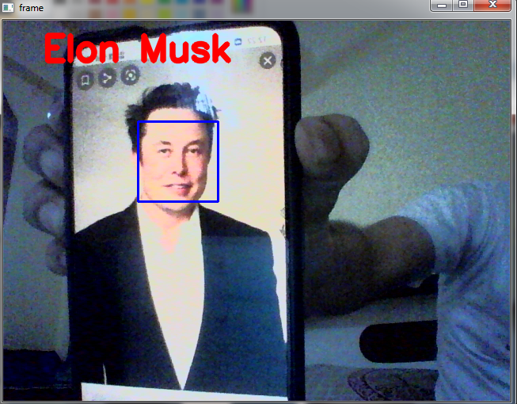
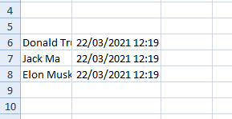

# Attendance Using Face Recognition

<h2>A small project in deep learning to take attendance using Face Recognition.</h2>                                                                                                         

<h3>Recognizing Faces</h3> 

  

  

  

<h3> Automatically taking attendance</h3>

  

